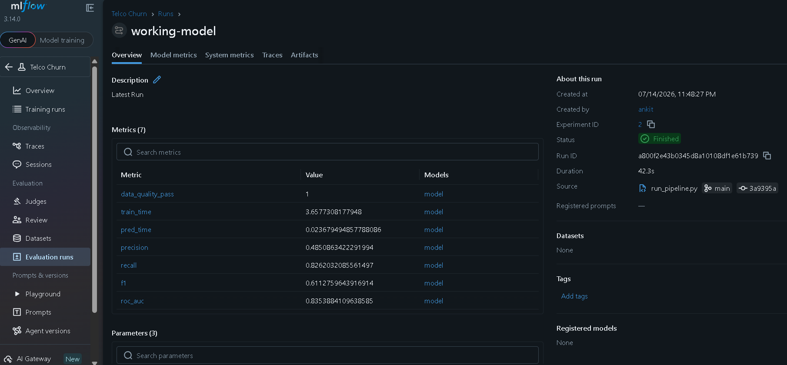
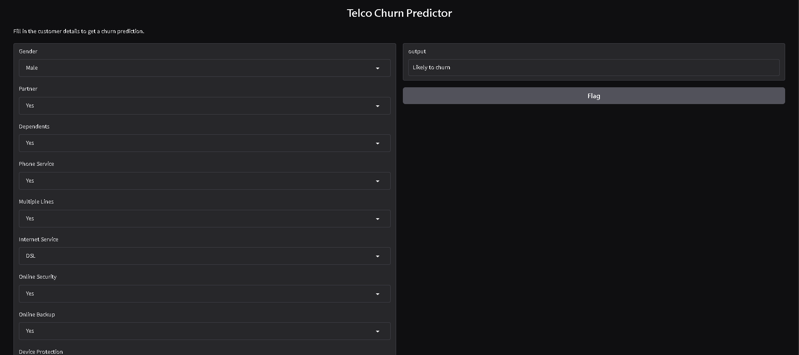

# 📊 Telco Customer Churn Prediction using XGBoost, FastAPI, MLflow & Gradio

An end-to-end Machine Learning project that predicts whether a telecom customer is likely to churn based on customer demographics, services subscribed, account information, and billing details.

The project demonstrates the complete ML lifecycle including data preprocessing, feature engineering, model training, experiment tracking with MLflow, model serving using FastAPI, and an interactive web interface using Gradio.

---

## 🚀 Features

- Data preprocessing pipeline
- Feature engineering
- XGBoost classification model
- MLflow experiment tracking
- FastAPI REST API
- Interactive Gradio UI
- Automatic model loading for inference
- Docker-ready project structure
- Ready for cloud deployment (Render)

---

## 📂 Project Structure

```
telco_churn_project/
│
├── data/
│   ├── raw/
│   └── processed/
│
├── notebooks/
│
├── scripts/
│   ├── run_pipeline.py
│   └── test_fastapi.py
│
├── src/
│   ├── app/
│   │     ├── app.py
│   │     └── main.py
│   │
│   ├── data/
│   ├── features/
│   ├── models/
│   ├── serving/
│   │      ├── inference.py
│   │      └── model/
│   └── utils/
│
├── mlruns/
├── requirements.txt
└── README.md
```

---

# 📌 Workflow

```
Raw Dataset
      │
      ▼
Data Loading
      │
      ▼
Preprocessing
      │
      ▼
Feature Engineering
      │
      ▼
Train/Test Split
      │
      ▼
XGBoost Training
      │
      ▼
Model Evaluation
      │
      ▼
MLflow Tracking
      │
      ▼
Model Artifacts
      │
      ▼
FastAPI
      │
      ├──── REST API (/predict)
      │
      └──── Gradio UI (/ui)
```

---

# 📈 Model Performance

| Metric    | Score |
| --------- | ----- |
| Precision | 0.485 |
| Recall    | 0.826 |
| F1 Score  | 0.611 |
| ROC AUC   | 0.835 |
| Accuracy  | 72.1% |

---

# 🛠 Technologies Used

### Programming

- Python

### Machine Learning

- XGBoost
- Scikit-learn
- Pandas
- NumPy

### Experiment Tracking

- MLflow

### API

- FastAPI
- Pydantic

### User Interface

- Gradio

### Deployment

- Docker
- Render

---

# 📦 Installation

Clone the repository

```bash
git clone https://github.com/YOUR_USERNAME/telco_churn_project.git

cd telco_churn_project
```

Create virtual environment

```bash
python -m venv .venv
```

Activate

Windows

```bash
.venv\Scripts\activate
```

Install dependencies

```bash
pip install -r requirements.txt
```

---

# ▶ Train the Model

```bash
python scripts/run_pipeline.py
```

This performs

- Data Loading
- Preprocessing
- Feature Engineering
- Model Training
- Evaluation
- MLflow Logging
- Model Export

---

# 📊 Launch MLflow

```bash
mlflow ui
```

Open

```
http://127.0.0.1:5000
```

Track

- Experiments
- Metrics
- Parameters
- Artifacts
- Models

---

# 🚀 Run FastAPI

```bash
uvicorn src.app.app:app --reload
```

Swagger Documentation

```
http://127.0.0.1:8000/docs
```

---

# 🎨 Open Gradio UI

```
http://127.0.0.1:8000/ui
```

Enter customer details and receive a churn prediction instantly.

---

# 📡 API Endpoint

POST

```
/predict
```

Example Request

```json
{
  "gender": "Male",
  "Partner": "Yes",
  "Dependents": "No",
  "PhoneService": "Yes",
  "MultipleLines": "Yes",
  "InternetService": "Fiber optic",
  "OnlineSecurity": "No",
  "OnlineBackup": "No",
  "DeviceProtection": "Yes",
  "TechSupport": "No",
  "StreamingTV": "Yes",
  "StreamingMovies": "Yes",
  "Contract": "Month-to-month",
  "PaperlessBilling": "Yes",
  "PaymentMethod": "Electronic check",
  "tenure": 12,
  "MonthlyCharges": 89.5,
  "TotalCharges": 1020.4
}
```

Example Response

```json
{
  "prediction": "Likely to churn"
}
```

---

# 📷 Screenshots

### MLflow



### Gradio UI



---

# Author

**Ankit Akash**
